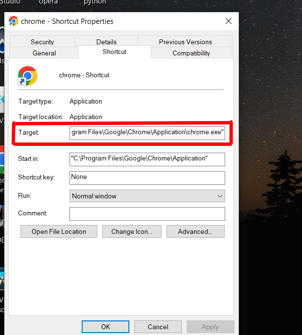

# AutoRunManager

## Description
AutoRunManager is a simple yet powerful application designed to help you manage the automatic execution of programs with customizable delays. Whether you're setting up a series of programs for work or organizing your system's startup behavior, AutoRunManager makes the process seamless.

## Features
- Add, remove, and view programs in the startup list.
- Launch programs with a specified delay.
- Detect running programs to avoid launching duplicates.
- User-friendly interface with notifications and prompts.

## How to Provide the Program Path?

To use this project, you need to provide the path of the programs you want to manage. Follow the steps below:

1. **Copy the Path** 

   To manually copy the program path, **right-click** on the program's shortcut, select **Properties**, and copy the address from the **Target** field.

   Example:

   

## 2. Add the Path

    After copying the program path, go to the **AutoRunManager** program and add the copied path in the input field.
    ⚠️ **Attention:** Make sure the path is correct. If the path doesn't exist on your system, the program will not accept it.

    **Example:**

    `C:\Program Files\MyApp\app.exe`

## 3. Save the Path

    Click on the **"OK"** button to save the path and add it to the **AutoRunManager** list.

## How Delays Work
Imagine you have two programs, Program A and Program B. You want Program A to start with a 10-second delay and Program B to start at the 15-second mark. Here's how to set it up:
1. For Program A, set the delay to **10 seconds**.
2. For Program B, instead of setting it to 15 seconds, set it to **5 seconds**. This way, Program B will launch 5 seconds after Program A starts, reaching the 15-second mark overall.

This delay calculation ensures seamless program launches without unnecessary gaps.

## Notification for Already Running Programs
If a program is already running, AutoRunManager will notify you with a message:  
**"This program is already running. Click 'OK' to continue."**  
Until you press 'OK', the next program in the list will not start. This ensures you have control over the execution timing.  
*(Note: This behavior will be improved in future updates to automate the process.)*

## How to Use
1. Open the application.
2. Add your desired programs along with their file paths and delays.
3. Save the configuration.
4. Start the execution process to see your programs launch as planned!

## Author
**Ilman**  
Email: [ilmanak.source@gmail.com](mailto:ilmanak.source@gmail.com)

## License
This application is free to use and share. Enjoy using AutoRunManager for all your program automation needs!
